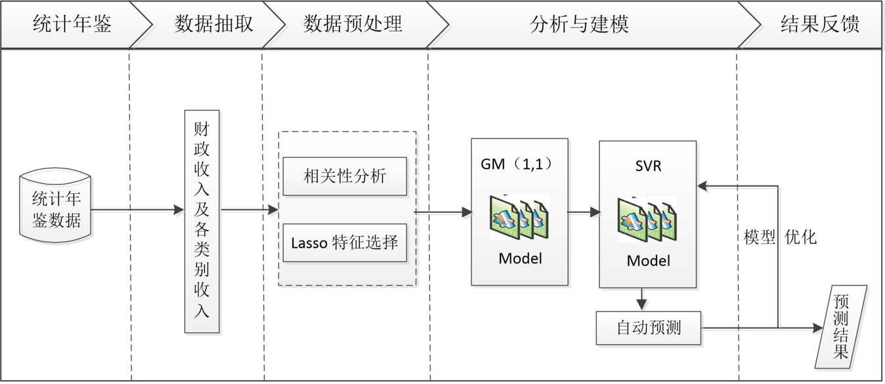
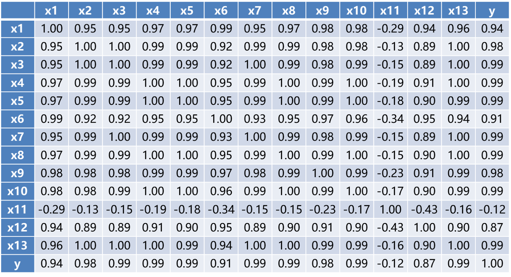
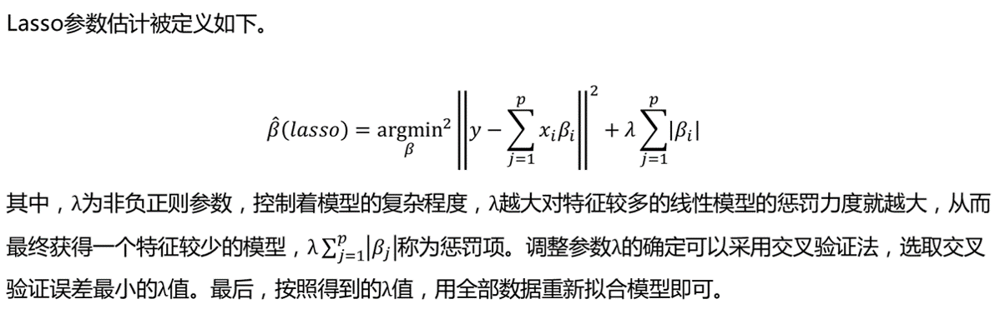
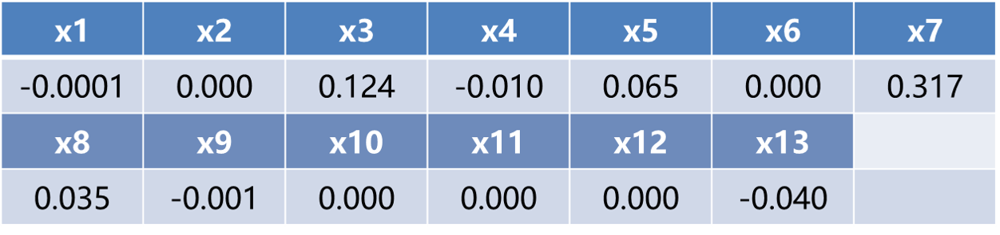
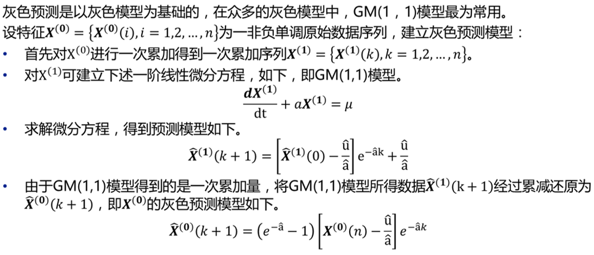
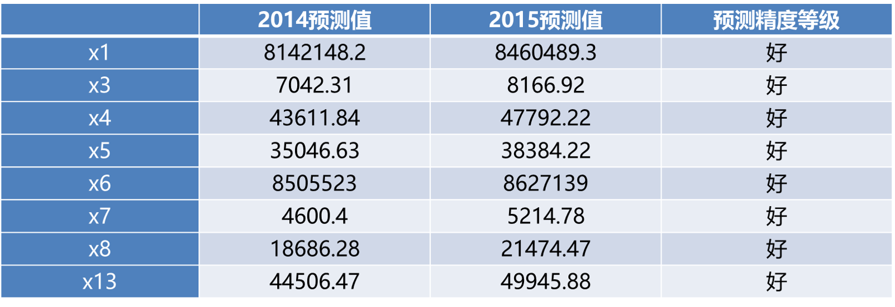
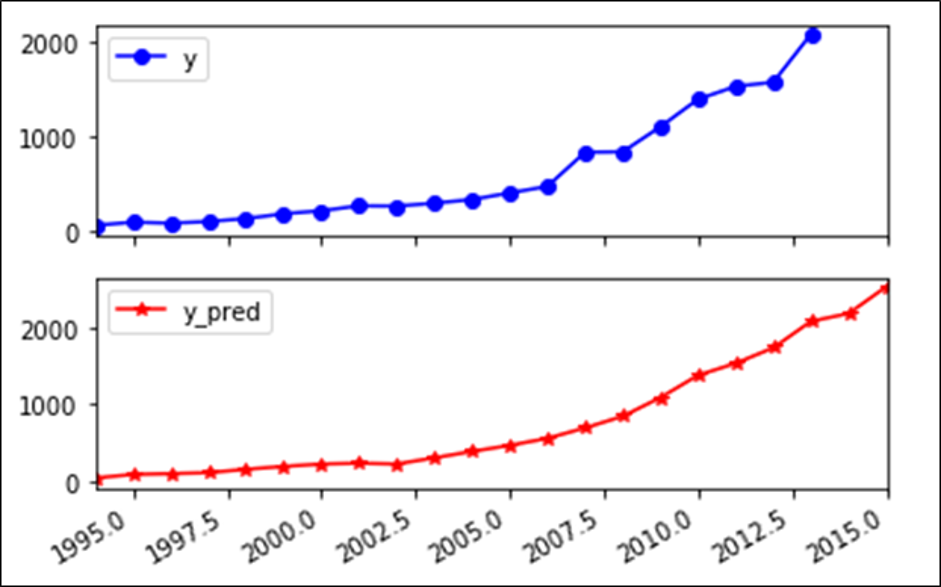
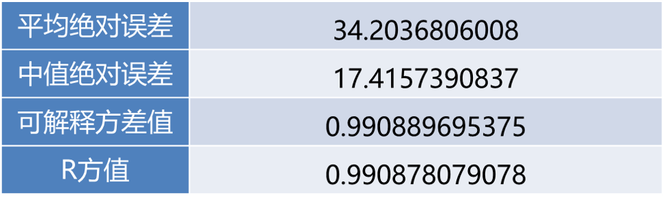

1.财政收入预测背景
财政收入：政府为履行职能，实施公共政策和提供公共物品与服务需要而筹集的一切资金的总和
* 目标：
分析、识别影响地方财政收入的关键特征。
预测2014年和2015年的财政收入。

* 数据时间跨度:1994-2013

* 自变量：
-社会从业人数(x1)：就业人数的上升伴随着居民消费水平的提高，从而间接影响财政收入的增加。
-在岗职工工资总额(x2)：反映的是社会分配情况，主要影响财政收入中的个人所得税、房产税以及潜在消费能力。
-社会消费品零售总额(x3)：代表社会整体消费情况，是可支配收入在经济生活中的实现。当社会消费品零售总额增长时，表明社会消费意愿强烈，部分程度上会导致财政收入中增值税的增长；同时当消费增长时，也会引起经济系统中其他方面发生变动，最终导致财政收入的增长。
-城镇居民人均可支配收入(x4)：居民收入越高消费能力越强，同时意味着其工作积极性越高，创造出的财富越多，从而能带来财政收入的更快和持续增长。
-城镇居民人均消费性支出(x5)：居民在消费商品的过程中会产生各种税费，税费又是调节生产规模的手段之一。在商品经济发达的如今，居民消费的越多，对财政收入的贡献就越大。
-年末总人口(x6)：在地方经济发展水平既定的条件下，人均地方财政收入与地方人口数呈反比例变化。
-全社会固定资产投资额(x7)：是建造和购置固定资产的经济活动，即固定资产再生产活动。主要通过投资来促进经济增长，扩大税源，进而拉动财政税收收入整体增长。
-地区生产总值(x8)：表示地方经济发展水平。一般来讲，政府财政收入来源于即期的地区生产总值。在国家经济政策不变、社会秩序稳定的情况下，地方经济发展水平与地方财政收入之间存在着密切的相关性，越是经济发达的地区，其财政收入的规模就越大。
-第一产业产值(x9)：取消农业税、实施三农政策，第一产业对财政收入的影响更小。
-税收(x10)：由于其具有征收的强制性、无偿性和固定性特点，可以为政府履行其职能提供充足的资金来源。因此，各国都将其作为政府财政收入的最重要的收入形式和来源。
-居民消费价格指数(x11)：反映居民家庭购买的消费品及服务价格水平的变动情况，影响城乡居民的生活支出和国家的财政收入。
-第三产业与第二产业产值比(x12)：表示产业结构。三次产业生产总值代表国民经济水平，是财政收入的主要影响因素，当产业结构逐步优化时，财政收入也会随之增加。
-居民消费水平(x13)：在很大程度上受整体经济状况GDP的影响，从而间接影响地方财政收入。

2.相关性分析

居民消费价格指数（x11）与财政收入（y）的线性关系不显著，呈现负相关。其余特征均与财政收入呈现高度的正相关关系。
按相关性大小，依次是x3，x4，x5，x7，x8，x10，x13，x2，x9，x1，x6和x12。
各特征之间存在着严重的多重共线性：
特征x1，x4，x5，x6，x8，x9，x10与除了x11之外的特征均存在严重的共线性。
特征x2，x3，x7与除了x11和x12外的其他特征存在着严重的多重共线性。
x11与各特征的共线性不明显。
x12与除了x2，x3，x7，x11之外的其他特征有严重的共线性。
x13与除了x11之外的各特征有严重的共线性。
x2和x3，x2和x13，x3和x13等多对特征之间存在完全的共线性。
由上述分析可知，选取的各特征除了x11外，其他特征与y的相关性很强，可以用作财政收入预测分析的关键特征，但这些特征之间存在着信息的重复，需要对特征进行进一步筛选。

3.使用Lasso回归选取财政收入预测的关键特征
* 原理：

Lasso回归方法属于正则化方法的一种，是压缩估计。
它通过构造一个惩罚函数得到一个较为精炼的模型，使得它压缩一些系数，同时设定一些系数为零，保留了子集收缩的优点，是一种处理具有复共线性数据的有偏估计。
Lasso以缩小特征集（降阶）为思想，是一种收缩估计方法。
Lasso方法可以将特征的系数进行压缩并使某些回归系数变为0，进而达到特征选择的目的，可以广泛地应用于模型改进与选择。
通过选择惩罚函数，借用Lasso思想和方法实现特征选择的目的。这种过程可以通过优化一个“损失”＋“惩罚”的函数问题来完成。

* 适用场景：
当原始特征中存在多重共线性时，Lasso回归不失为一种很好的处理共线性的方法，它可以有效地对存在多重共线性的特征进行筛选。
在机器学习中，面对海量的数据，首先想到的就是降维，争取用尽可能少的数据解决问题，从这层意义上说，用Lasso模型进行特征选择也是一种有效的降维方法。
Lasso从理论上说，对数据类型没有太多限制，可以接受任何类型的数据，而且一般不需要对特征进行标准化处理。

* 优缺点：
优点：可以弥补最小二乘法和逐步回归局部最优估计的不足，可以很好地进行特征的选择，可以有效地解决各特征之间存在多重共线性的问题。
缺点：如果存在一组高度相关的特征时，Lasso回归方法倾向于选择其中的一个特征，而忽视其他所有的特征，这种情况会导致结果的不稳定性。
虽然Lasso回归方法存在弊端，但是在合适的场景中还是可以发挥不错的效果。在财政收入预测中，各原始特征存在着严重的多重共线性，多重共线性问题已成为主要问题，这里采用Lasso回归方法进行特征选取是恰当的。

由上表可看出，利用Lasso回归方法识别影响财政收入的关键影响因素是社会从业人数（x1）、社会消费品零售总额（x3）、城镇居民人均可支配收入（x4）、城镇居民人均消费性支出（x5）、全社会固定资产投资额（x7）、地区生产总值（x8）、第一产业产值（x9）和居民消费水平（x13）。

4.使用灰色预测和SVR构建财政收入预测模型
* 原理：

灰色预测法是一种对含有不确定因素的系统进行预测的方法。
在建立灰色预测模型之前，需先对原始时间序列进行数据处理，经过数据处理后的时间序列即称为生成列。
灰色系统常用的数据处理方式有累加和累减两种。

* 适用场景：
灰色预测法的通用性比较强些，一般的时间序列场合都可以用，尤其适合那些规律性差且不清楚数据产生机理的情况。

* 优缺点：
优点：具有预测精度高、模型可检验、参数估计方法简单、对小数据集有很好的预测效果。
缺点：对原始数据序列的光滑度要求很高，在原始数据列光滑性较差的情况下灰色预测模型的预测精度不高甚至通不过检验，结果只能放弃使用灰色模型进行预测。

5.分析预测结果
* 通过GM模型得出的预测值
社会从业人数（x1）、社会消费品零售总额（x3）、城镇居民人均可支配收入（x4）、城镇居民人均消费性支出（x5）、全社会固定资产投资额（x6）、地区生产总值（x7）、第一产业产值（x8）和居民消费水平（x13）特征的2014年及2015年通过建立的灰色预测模型得出的预测值，如下表所示。

将上表的预测结果代入地方财政收入建立的支持向量回归预测模型，得到1994年至2015年财政收入的预测值，其中Y_pred表示预测值。

采用回归模型评价指标对地方财政收入的预测值进行评价，得到的结果如下表所示。
 
可以看出平均绝对误差与中值绝对误差较小，可解释方差值与R方值十分接近1，表明建立的支持向量回归模型拟合效果优良，可以用于预测财政收入。

# -
